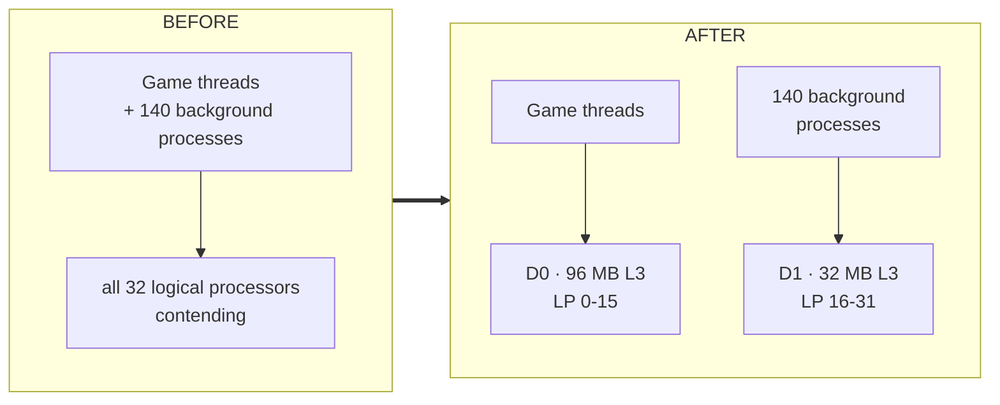
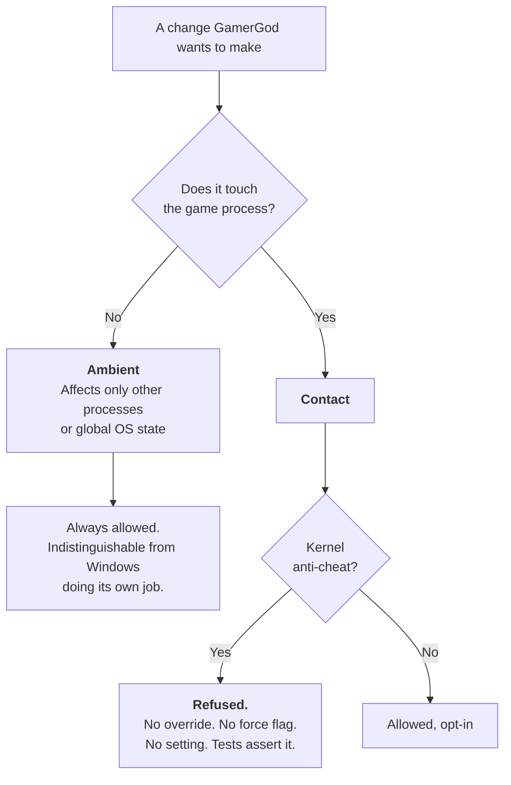
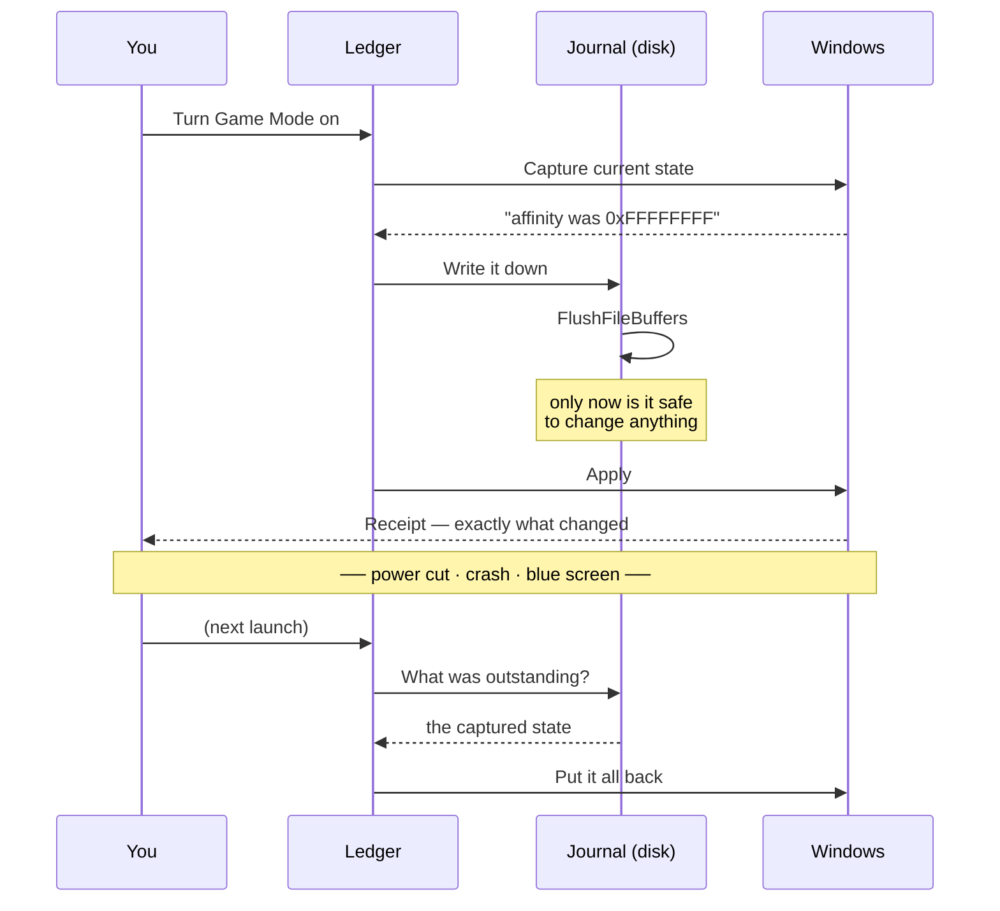

<div align="center">

# GamerGod

### *Microsoft Sucks Edition*

**Give your game the machine you paid for. Give Windows it back when you're done.**

`Partition` · `Prove` · `Preserve` · `Protect`

[](https://github.com/kosherplay-betatester/GamerGod-Microsoft-Sucks-Edition/releases/latest)
[](LICENSE)
[](tests)

[](CHARTER.md)
[](CHARTER.md)
[](CHARTER.md)
[](CHARTER.md)
[](#ambient-and-contact--the-idea-everything-rests-on)

**[⬇ Download the installer](https://github.com/kosherplay-betatester/GamerGod-Microsoft-Sucks-Edition/releases/latest)** · **[Read the Charter](CHARTER.md)**

</div>

---

## The one-paragraph version

Every "game booster" you have ever seen makes the same three promises and keeps none of them:
it will speed up your game, it will not break anything, and you can undo it. GamerGod is built
so the second and third are true **architecturally** — not because the code tries hard, but
because it cannot express the alternative — and so the first is never claimed until it has been
measured on *your* machine.

---

# How it works

## The idea

A modern CPU is not a pool of identical cores. A Ryzen X3D has one die with a huge L3 cache and
one without. An Intel hybrid chip has performance cores and efficiency cores. Windows knows this
and mostly does the right thing — right up until 140 background processes all want a timeslice
and your game's thread ends up sharing a cache with a browser tab.

GamerGod partitions the machine. Your game keeps the good cores; everything else is moved onto
the others.



Nothing is guessed. The layout is read from `GetLogicalProcessorInformationEx`, and a
**performance domain** is defined as a set of logical processors sharing *all three* of: an L3
cache instance, an efficiency class, and a processor group. On the reference machine that yields
exactly two domains. On a laptop it may yield one — and then GamerGod says so, rather than
pretending it helped.

> **Why not just set priority?** Because priority is advisory and cache is not. Moving a
> background process to another die stops it evicting your game's working set from L3. That is a
> physical change, not a hint.

## Ambient and Contact — the idea everything rests on

Every change GamerGod can make is one of two kinds, and the type system enforces which.



**Everything GamerGod ships today is Ambient.** It never reads, writes, hooks, or opens a handle
to your game. From an anti-cheat's point of view, nothing happened to the game at all — some
*other* processes changed scheduling, which is a thing Windows does by itself all day.

That is why it works with Battlefield 6, Vanguard, EAC, BattlEye, Ricochet and the rest. Not
because of a compatibility list that needs updating, but because there is nothing to detect.

## Journal before apply — why "undo" always works

The order is the whole guarantee.



A mutation that cannot describe its own inverse **cannot be written** — the interface requires
one. Reverts run in descending tier, are idempotent, and a failure in one never aborts the rest.

The subtle part: reverting is conditional on *how* a change was made. Processor affinity and
efficiency mode die with the process that carried them, so a reboot already undid them and
re-applying a captured value would hit a **recycled process id**. A registry value does not die
with a reboot, so it still gets restored. The journal records which boot each session began in,
precisely to tell those two cases apart.

## What the app is made of

```
GamerGod.Core          pure domain - mutations, ledger, policy, catalogue, search,
                       measurement. NO OS calls. Contains the Engine/ and Measurement/
                       namespaces; they are folders here, not separate projects.
GamerGod.Windows       the ONLY project that P/Invokes. NativeMethods.txt is the audit surface.
GamerGod.Ui            the WPF desktop app
GamerGod.Cli           gamergod.exe - and the privileged broker the app calls for elevation
```

`Core` **cannot** reference `GamerGod.Windows` — an architecture test fails the
build if they do. That constraint is what makes the chaos tests possible: the entire ledger runs
against a fake operating system, with no admin rights and no real machine state, so a power cut
can be simulated 500 times in a second.

## Why it asks for permission

The revert journal lives in `C:\ProgramData\GamerGod\state`, where ordinary users have
**read-only** access. That is deliberate — the journal *is* the restore guarantee, and it must
not be editable by whoever happens to be logged in.

So the app runs with no special rights (browsing your library, the free-games list and the
catalogue needs none), and Windows asks for permission at the one moment the machine is about to
change. The Dashboard tells you which mode you are in **before** you press anything:

| Indicator | Meaning |
|---|---|
| `Windows will ask permission` | Normal launch. One prompt when you arm. |
| `running as administrator` | Started elevated. No prompt needed. |
| `gamergod.exe missing — reinstall` | The broker is absent; arming cannot work. |

---

# What you get

<table>
<tr>
<td width="33%" valign="top">

### ⚡ Dashboard
The one switch that matters. A live map of every logical processor on your CPU, and a **receipt**
after every action listing exactly what changed.

</td>
<td width="33%" valign="top">

### 🎮 Library
Your installed games as cover-art tiles, read from manifests Steam, Epic and GOG already keep on
disk. Selecting is free; a tray states what launching will do to your machine, next to the button
that does it.

</td>
<td width="33%" valign="top">

### 🆓 Free games
347 free-to-play and permanently-free PC titles with key art — Overwatch, Apex, Fortnite,
Destiny 2, Warframe, PUBG, War Thunder, Path of Exile. Fetched only when you ask.

</td>
</tr>
<tr>
<td valign="top">

### 📦 Get more
54 programs installed through the Windows Package Manager: every storefront, four library
managers, overclocking and monitoring tools, and emulators from arcade cabinets to the
PlayStation 4 — plus Android via Google's own runtime.

</td>
<td valign="top">

### 🚀 Apps
Your installed launchers and emulators with their real icons, read out of their own executables.
One click to start, Game Mode armed first.

</td>
<td valign="top">

### 🔍 Search
On every list, and it tolerates typos. `battlefeild` → Battlefield. `wot` → World of Tanks.
`fortnight` → Fortnite. Right title first for **15 of 15** real misspellings, ~2 ms per keystroke.

</td>
</tr>
</table>

### Emulators, old school to current

| Era | What runs |
|---|---|
| **Arcade & home computers** | MAME · ScummVM · DOSBox Staging · DOSBox-X · WinUAE |
| **8- and 16-bit** | Mesen 2 · FCEUX · Snes9x |
| **32- and 64-bit** | DuckStation · Project64 · redream · Flycast |
| **DVD era** | PCSX2 · Dolphin · xemu |
| **HD era** | RPCS3 · Xenia · Cemu · **shadPS4** |
| **Handhelds** | mGBA · melonDS · Azahar · PPSSPP · Vita3K |
| **Everything at once** | RetroArch · BizHawk · ares |
| **Android** | Google Play Games on PC · BlueStacks |

Emulators are legal software. What you run on them is your business — there are **no ROMs here,
no BIOS files, and no links to either**, and two tests hold that line. Consoles that cannot boot
without a BIOS say so on their entry, because a black screen looks like broken software to
somebody who was never told why.

---

# The Charter

[`CHARTER.md`](CHARTER.md) is binding. Articles I–VI **cannot be amended** — not by a maintainer,
not by a pull request, not by a setting.

| | |
|:--:|---|
| **I** | Never break your games |
| **II** | Never ship a kernel driver |
| **III** | Never inject into, hook, or modify a game |
| **IV** | Never collect telemetry |
| **V** | Never weaken your security for frames |
| **VI** | Nothing survives a reboot unless you said so |
| **VII** | Never claim an unmeasured benefit |
| **VIII** | Free forever, GPLv3, reproducible builds |
| **IX** | Build the conductor, not every instrument |
| **X** | Four escape paths, always |

### What that rules out, concretely

No `WriteProcessMemory`. No `CreateRemoteThread`. No cross-process `SetWindowsHookEx`. No
`bcdedit`. No kernel driver. No service `StartType` changes. No AppX removal. No disabling
Defender, VBS, HVCI, Secure Boot, TPM or exploit mitigations — **ever**, for any frame rate.
`PROCESS_ALL_ACCESS` does not appear in the codebase, and an analyzer fails the build if it does.

### About the network

Article IV forbids an update ping in one sentence and permits *"checking for a release"* in the
next. The difference is entirely **consent**. GamerGod has exactly four outbound connections,
every one off by default and behind a dialog that itemises what leaves your machine:

| Feature | What is sent | Default |
|---|---|:--:|
| Game cover art | A numeric store id | **Off** |
| Program logos | A request to the project's own site | **Off** |
| Release check | Nothing but the request itself | **Off** |
| Free-games catalogue | Nothing but the request itself | **Off** |

No account. No cookie. No identifier. Nothing about your hardware, your settings, or what you
play. There are no other connections, and tests assert the addresses.

---

# Install

**[⬇ Download `GamerGod-Setup.exe` from the latest release.](https://github.com/kosherplay-betatester/GamerGod-Microsoft-Sucks-Edition/releases/latest)**
Self-contained — no .NET runtime needed.

The installer tells you what it will do before it does it, and delegates the real work to
[`install/Install-GamerGod.ps1`](install/Install-GamerGod.ps1), so there is exactly one
description of what installing GamerGod changes and you can read it first.

### From source

```powershell
git clone https://github.com/kosherplay-betatester/GamerGod-Microsoft-Sucks-Edition.git
cd GamerGod-Microsoft-Sucks-Edition

dotnet test                       # 669 tests: unit + chaos + architecture
pwsh install\Build-Installer.ps1  # test → publish → stage → compile
```

### The command line

```powershell
gamergod topology   # what GamerGod can see about your CPU
gamergod scan       # read-only health check; changes nothing
gamergod on         # arm
gamergod status     # what is currently changed
gamergod off        # put everything back
gamergod restore    # recover after a crash
```

---

# Safety

**669 tests.** Unit, architecture, and chaos tests that kill the process at every possible point
in an apply-and-revert cycle — 500 trials at a time, against a fake OS — and assert the machine
always ends clean.

```powershell
dotnet test                     # safe: unit + chaos + architecture
dotnet test --filter "Host=VM"  # VM ONLY. Stops services, kills explorer.exe.
```

The tests are not decoration, and they are not where the real bugs came from. Every serious
defect this project has shipped was found by running against **real hardware** and then pinned
with a test — including a protection-list entry for `hwinfo`, a process name no machine actually
runs, which read as protection and provided none.

### Four ways out, always

1. The switch in the app
2. `gamergod off`
3. Close the app — nothing it applies is boot-persistent
4. **Reboot** — everything is back, with no GamerGod code running at all

---

# Status

**Shipping** — domain partitioning · efficiency-mode demotion · service suspension · power-scheme
management · the full ledger and journal · crash recovery · the desktop app · game library ·
software catalogue · free-games browser · typo-tolerant search · opt-in release check.

**Designed, not yet built** — the background service and crash watchdog · stutter forensics · the
in-app performance overlay · autotune.

**Deliberately absent — a frame-rate number.** GamerGod will not tell you how many frames it
gained, because it has not measured *yours*. When the measurement harness lands you will get a
real figure with error bars. The first thing it ever reported was that a configuration made
things **worse** — which is exactly why the number has to be real before it is printed.

---

# Documentation

| | |
|---|---|
| [`CHARTER.md`](CHARTER.md) | The binding constraints |
| [`CLAUDE.md`](CLAUDE.md) | Invariants and conventions for contributors |
| [`docs/REFERENCE-MACHINE.md`](docs/REFERENCE-MACHINE.md) | The hardware everything is validated against |
| [`NativeMethods.txt`](src/GamerGod.Windows/NativeMethods.txt) | Every P/Invoke, in one auditable list |

---

# Contributing

Read [`CHARTER.md`](CHARTER.md) first. A change that violates Articles I–VI will be declined
however good it is — that is the point of writing them down.

### Why GPLv3 and not MIT

Because the entire value of this project is that you can verify what it does. A permissive
licence lets somebody ship a closed fork that adds a kernel driver, phones home, and keeps the
name. GPLv3 means any fork stays readable.

---

<div align="center">

**Free forever · No telemetry · No drivers · Your machine, back exactly as it was**

</div>
