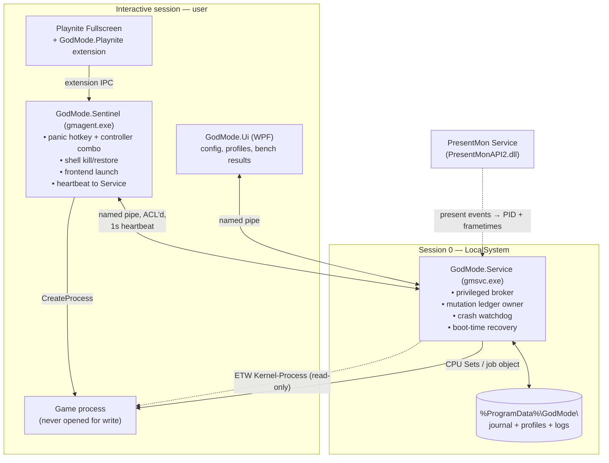
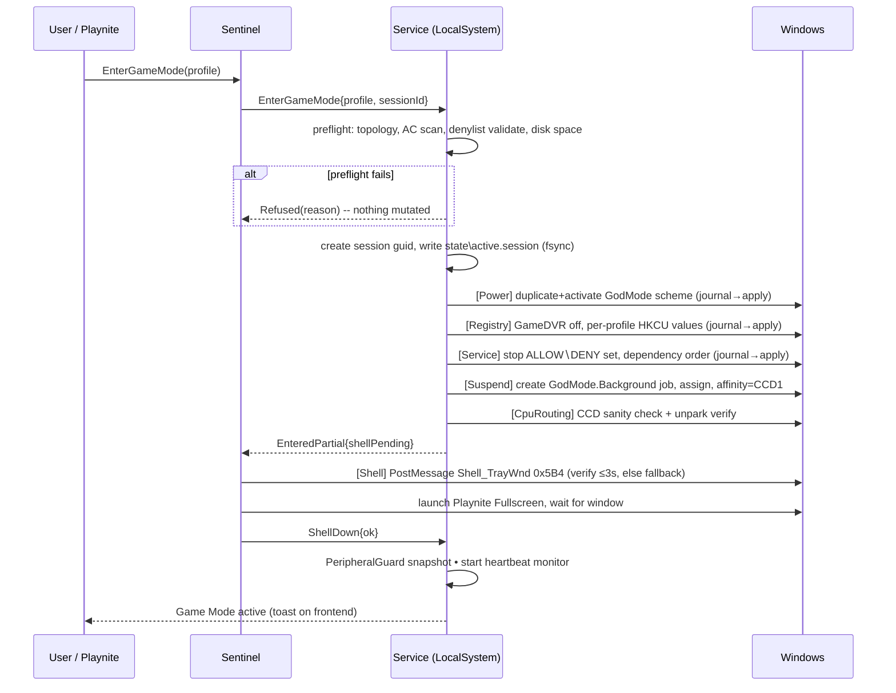
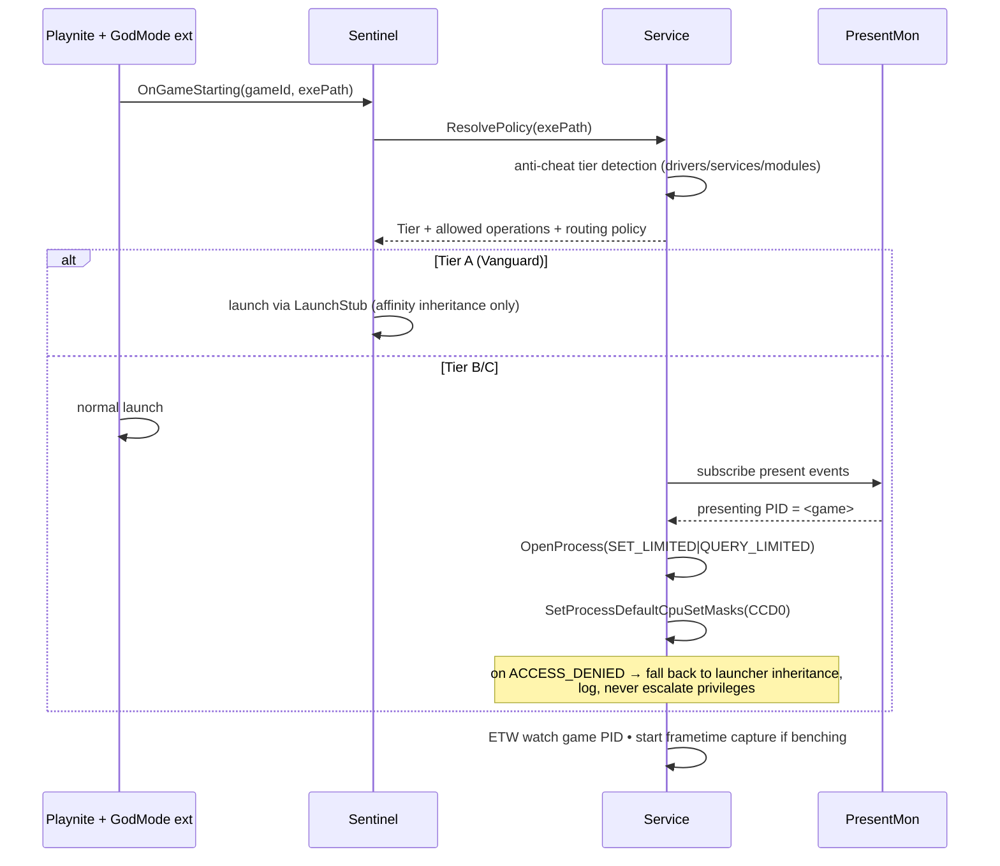
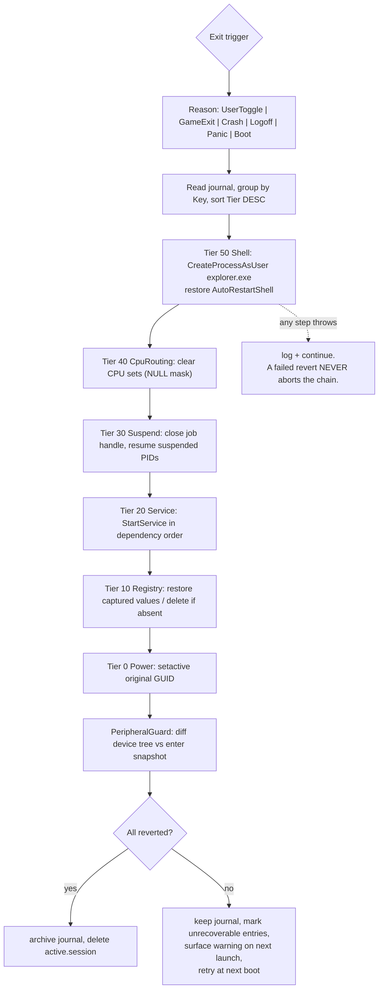

# GodMode: Microsoft Sucks Edition — Master Plan

> **For agentic workers:** This is the architecture-level master plan. Task-level TDD plans live in `docs/plans/YYYY-MM-DD-<milestone>.md` and are generated per milestone from Section 11.

**Goal:** Turn Windows 11 into a console-like, low-overhead gaming environment on demand, with a hard guarantee that *any* exit path — clean toggle, app crash, power loss, reboot — returns the machine to exactly its prior state.

**Architecture:** Every OS change is a journaled, self-inverting `Mutation` object written to disk *before* it is applied. An elevated Windows Service owns all privileged operations and acts as the crash watchdog; an unprivileged per-session Sentinel owns hotkeys, the frontend, and shell restore. Nothing is injected into games, no kernel driver is shipped, and no change survives a reboot unless the ledger says it should.

**Tech Stack:** C# / .NET 10 LTS, CsWin32 source-generated P/Invoke, NativeAOT for Service + Sentinel, WPF for the desktop config UI, Playnite Fullscreen as the controller shell, Intel PresentMon SDK for measurement, TraceEvent (ETW) for game detection.

**Target reference machine:** Ryzen 9 7950X3D (CCD0 = 96 MB L3, CCD1 = 32 MB L3), Windows 11 Pro 25H2 (build 26200), `amd3dvcache` + `AmdPPM` present.

---

## 0. Verdict on the proposed architecture

The spec is unusually well-formed. Six of the eight core ideas are correct and should be built as written. Two are wrong in ways that will actively cost you frames, and three critical things are missing.

### 0.1 Sound — build as specified

| Spec item | Verdict |
|---|---|
| Non-destructive, reboot-restores-everything | ✅ Correct, and it should be promoted from a *policy* to a *type-system invariant* (Section 4). |
| Fail-safe watchdog for shell recovery | ✅ Correct, but it needs a second tier: watchdog-watches-app **and** boot-time journal recovery. A watchdog that dies with the app is not a watchdog. |
| Peripherals must keep working | ✅ Correct. Implementation is a hardware-adjacent service **denylist**, not a passthrough mechanism (Section 6.3). |
| Controller-navigable frontend | ✅ Correct. Use Playnite Fullscreen, not a bespoke UI. |
| Anti-cheat must stay unhindered | ✅ Correct, and it should be an enforced policy engine, not a code review convention (Section 6.6). |
| Dual-CCD X3D routing | ✅ Correct instinct, wrong mechanism — see 0.2. |

### 0.2 Wrong — two design corrections

**Correction 1: Do not park the second CCD. Load it up.**

The spec says *"non-gaming background threads are isolated to the secondary CCD **or parked completely**."* Those two options are opposites, and parking is the worse one. Parking is what AMD's stock 3D V-Cache Performance Optimizer path does, and it has a well-known side effect: when CCD1 is parked, every background thread on the system is forced onto CCD0 — where it now contends with the game for the exact 96 MB of L3 you parked CCD1 to protect. The [CPU Set Setter](https://github.com/SimonvBez/CPUSetSetter) project documents this directly: *"Windows usually accomplish this by turning off the other CCD (called parking), but this means background processes will now also be forced onto the same CCD as the game, leading to lower and less consistent framerates."*

GodMode's whole reason to exist on an X3D part is that it can do the thing AMD's driver structurally cannot: **keep both CCDs awake and partition them.** Game → CCD0. Everything else on the machine → CCD1. That is strictly better than parking, and it is the single highest-value feature in this project.

Parking stays in the codebase only as an explicitly-labelled comparison profile for the A/B harness, so you can prove the above on your own 7950X3D rather than take my word for it.

**Correction 2: Do not use hard affinity on the game. Use CPU Sets.**

The spec says *"programmatically enforce core affinity so active game processes are strictly pinned."* Hard affinity (`SetProcessAffinityMask`) is the wrong tool here for three independent reasons:

1. **Privilege.** `SetProcessAffinityMask` needs a handle with `PROCESS_SET_INFORMATION`. `SetProcessDefaultCpuSetMasks` needs only [`PROCESS_SET_LIMITED_INFORMATION`](https://learn.microsoft.com/en-us/windows/win32/api/processthreadsapi/nf-processthreadsapi-setprocessdefaultcpusetmasks). Protected-process anti-cheats strip the former far more often than the latter. Lower privilege = works on more titles = fewer reasons for an anti-cheat to care about you.
2. **Stability.** A CPU Set is a strong scheduler *hint* that can be deviated from under pressure. A hard affinity mask is a wall. Games that spawn their own affinity-aware thread pools, or that hard-assert on `GetProcessAffinityMask`, misbehave or deadlock behind a wall. Several titles are known to freeze under externally-applied affinity but run fine under CPU Sets.
3. **Composition.** CPU Sets stack cleanly with the game's own `SetThreadSelectedCpuSetMasks` calls. Affinity masks silently clamp them.

So: **CPU Sets are the primary mechanism, hard affinity is the per-profile fallback for old titles that ignore CPU Sets.** Both go in; CPU Sets is the default.

### 0.3 Missing — three things the spec doesn't have and needs

**Missing 1: A measurement harness. This is the most important omission.**

Without it, this project is astrology with a nice UI. Nearly every "gaming tweak" in circulation is unmeasured, and a large fraction of them are net-negative. You are building a tool whose entire value proposition is a frametime delta — so frametime measurement must be a first-class subsystem, not a nice-to-have.

Intel's [PresentMon Service](https://github.com/GameTechDev/PresentMon/blob/main/README-Service.md) ships `PresentMonAPI2.dll` with a documented C API and a loader lib, giving programmatic ETW-based frametime + GPU telemetry capture. GodMode should ship an A/B harness that runs the same workload under profile A and profile B and reports avg / 1% low / 0.1% low / frametime variance **with confidence intervals**, so "does killing explorer.exe help?" is a question with an answer on *your* machine instead of a forum opinion.

Second benefit, and it's a big one: PresentMon tells you *which PID is presenting frames*. That is the cleanest possible game detector — the process putting pixels on screen **is** the game — and it requires opening zero handles to it.

**Missing 2: A crash-recovery tier that survives the watchdog itself dying.**

The spec's watchdog relaunches `explorer.exe` if the *game* crashes. That covers the second-most-likely failure. The most likely failure is *GodMode itself* crashing (or being killed, or the machine losing power) mid-mutation, with explorer dead and 14 services stopped. The answer is a write-ahead journal on disk plus a boot-time recovery pass in an auto-start service — so "reboot fixes it" is true *by construction*, not by hope.

**Missing 3: An awareness that Microsoft is shipping your Section 5.**

Windows 11 already has a console-style shell that replaces the Explorer desktop at boot, defers desktop subsystems and background tasks, and is [reported to save on the order of 2 GB of RAM](https://windowsforum.com/threads/windows-11-xbox-full-screen-experience-console-style-gaming-on-pc.392878/). It shipped on handhelds, is [enable-able on any 25H2 PC](https://pureinfotech.com/windows-11-enable-xbox-full-screen-experience-any-pc/), and is [being renamed "Xbox mode" with a broad rollout through 2026](https://www.kitguru.net/gaming/joao-silva/windows-11-full-screen-experience-is-now-becoming-xbox-mode/).

This is good news, not bad. It validates the "kill the shell" thesis with Microsoft's own engineering, and it means GodMode should **compose with Xbox mode rather than reimplement it**: let Microsoft own the shell swap where available, and spend your effort on the four things Xbox mode does *not* do — X3D CCD partitioning, service/process control with a reversibility guarantee, measurement, and per-game profiles. Detect Xbox mode at runtime and switch to "co-op mode" when it's active.

### 0.4 The honest performance ledger

Build the harness (Missing 1) and replace this table with your own numbers. Until then, these are calibrated expectations, not measurements — and the ordering matters more than the magnitudes. **Rows 1–4 are where the frames are. Rows 6–10 are where the internet spends its time.**

| # | Lever | Expected avg FPS | Expected 1% low | Reversible? | Notes |
|---|---|---|---|---|---|
| 1 | **X3D CCD partition (game→CCD0, rest→CCD1)** | **+5–25%** | **+10–30%** | ✅ instant | Only on dual-CCD X3D. Cache-sensitive titles (sims, MMOs, strategy) at the top of the range; GPU-bound titles ~0. |
| 2 | In-game frame cap under refresh + VRR + Reflex/Anti-Lag 2 | ~0 | large latency win | n/a (per-game) | Not an OS lever, but it dwarfs everything below. GodMode should *nag* about it, not implement it. |
| 3 | Exclusive fullscreen, or [windowed-game optimizations](https://support.microsoft.com/en-us/windows/optimizations-for-windowed-games-in-windows-11-3f006843-2c7e-4ed0-9a5e-f9389e535952) for DX10/11 borderless | 0–3% | 0–5% | ✅ instant | Flip-model instead of blt-model. Free, already in the OS, most users have it off. |
| 4 | Suspending an active browser / Discord / Electron pile | 0–8% | **0–20%** | ✅ instant | Highly bimodal. Near-zero on a clean machine, large on a machine with 60 Chrome tabs. |
| 5 | Power scheme → high performance (duplicated scheme) | 0–3% | 0–5% | ✅ instant | Mostly matters on laptops and for parked-core wakeup latency. |
| 6 | Stopping SysMain / WSearch / Update stack | ~0–1% | 0–5% | ✅ instant | Averages ~0. The real win is removing *stutter events*, which only 0.1% lows show. |
| 7 | Killing `explorer.exe` | **~0%** | 0–2% | ✅ instant | ~100–200 MB and near-zero CPU. Real benefit is UX (console feel) + removing shell file-watcher stutter, **not** FPS. Say so in the UI. |
| 8 | HAGS on/off | −3% to +3% | −5% to +5% | ⚠️ reboot | Genuinely sign-uncertain per system. Pure A/B territory. |
| 9 | Global timer resolution 0.5 ms | −2% to +2% | −5% to +5% | ⚠️ reboot | Per-process since Win10 2004. Restoring global behaviour is a reboot-tier registry change. Frequently net-negative. |
| 10 | Network stack registry "tweaks" (Nagle, autotuning, TcpAckFrequency) | 0% | 0% | ✅ but pointless | Cargo cult. Excluded from GodMode. Section 10. |
| 11 | Disabling Spectre/Meltdown mitigations | +2–8% | +2–8% | ⚠️ reboot, security downgrade | Real gains, real risk. Section 10 — documented, not implemented. |

**The design consequence:** rows 1, 3, and 4 justify this entire project. Rows 6–9 are worth *offering* with measurement attached, and worth being honest in the UI about. Ship a tool that tells the truth about its own placebo surface and you have something no "debloat script" on GitHub has.

---

## 1. Design principles (non-negotiable)

These are enforced by architecture and tests, not by discipline.

1. **No mutation without a journal entry.** Every OS change goes through `IMutation` and is persisted (with `FlushFileBuffers`) *before* `Apply()` runs. A mutation type that cannot describe its own inverse cannot be written.
2. **Reboot is always a valid recovery path.** No change may be written to a boot-persistent location unless it is registered in the boot-recovery journal. This is asserted by an integration test that snapshots the VM, applies every mutation, hard-resets, and diffs.
3. **Never touch the game's memory or code.** No injection, no hooking, no `WriteProcessMemory`, no `CreateRemoteThread`, no `SetWindowsHookEx` into game processes, no IFEO entries for game executables. Enforced by a Roslyn analyzer that fails the build on banned P/Invoke signatures.
4. **Never ship a kernel driver.** Ever. It is the single largest source of BSODs, anti-cheat conflicts, and attestation failures in this software category, and it removes your ability to say "we cannot destabilize your system."
5. **Deny by default on hardware.** Any service, driver, or process with a device, audio, input, power, or thermal relationship is on a hard denylist that the allowlist cannot override.
6. **Every claim is measured.** A profile toggle that has never been A/B'd on the local machine is shown in the UI as *unmeasured*.
7. **Fail closed toward Windows.** Every ambiguous state, every unhandled exception, every timeout resolves toward "restore the desktop."

---

## 2. Tech stack recommendation

### 2.1 The recommendation

**C# on .NET 10 LTS** (released 2025-11-11, supported to Nov 2028), with `Microsoft.Windows.CsWin32` for source-generated P/Invoke, published **NativeAOT** for the Service and Sentinel.

You have .NET 9 SDK installed (9.0.106/113/119). Install the .NET 10 SDK — 9 is STS with a shorter tail, and 10 is the LTS you want under a tool that runs as LocalSystem.

### 2.2 Why, and why not the alternatives

| Option | Verdict |
|---|---|
| **C# / .NET 10** | ✅ **Chosen.** Full Win32 surface via CsWin32 with compile-time-checked signatures; first-class Windows Service host (`Microsoft.Extensions.Hosting.WindowsServices`); real testability (interfaces + fakes, which is what makes the reversibility guarantee provable); NativeAOT gives a ~5 MB dependency-free binary with fast startup and no JIT pauses in the watchdog; WPF for the config UI; and Playnite extensions are C#, so your frontend integration is the same language. |
| PowerShell | ❌ As the engine. 300–800 ms startup per invocation kills the watchdog loop; no structured crash handling; `-EncodedCommand` and process-manipulation cmdlets are heavily weighted by EDR heuristics; and there is no good way to hold a job object handle open for the session lifetime. ✅ **Keep it for one thing:** a `GodMode.Extensions` folder of user-authored `.ps1` hooks invoked at enter/exit, sandboxed and journaled. That gives you scriptability without putting the safety-critical path in a script host. |
| Python | ❌ Packaging an elevated, code-signed, AOT-free service is painful; `pywin32` coverage of CPU Sets / job objects / ETW is thin; and a bundled interpreter in `%ProgramFiles%` running as LocalSystem is a genuine local-privilege-escalation surface. |
| C++ / C++20 | ⚠️ Only where forced. Nothing here needs it — every API in this document is reachable from CsWin32. The cost is 5× the code and no test doubles for the OS layer, which is exactly the property that makes the reversibility guarantee unverifiable. **Exception:** if a stub launcher must be ≤100 KB and start in under a millisecond, write `GodMode.LaunchStub` in C++. |
| Rust | ⚠️ Excellent for the engine (`windows-rs` is first-rate) but you lose the Playnite/WPF integration and there is no ecosystem win that offsets writing two UIs. Reasonable if you already write Rust daily; otherwise the C# path ships faster with the same safety properties, because the safety here is architectural, not memory-safety-related. |
| Kernel driver (any language) | ❌ See principle 4. |

### 2.3 Key dependencies

| Package | Purpose |
|---|---|
| `Microsoft.Windows.CsWin32` | Source-generated P/Invoke. Add only the APIs listed in `NativeMethods.txt`, which doubles as your audit surface. |
| `Microsoft.Extensions.Hosting.WindowsServices` | Service host, logging, DI. |
| `Microsoft.Diagnostics.Tracing.TraceEvent` | Real-time ETW consumption (`Microsoft-Windows-Kernel-Process`) for zero-handle process lifecycle tracking. |
| `System.Management` | WMI fallback for topology/device queries where CsWin32 is awkward. |
| PresentMon SDK (`PresentMonAPI2Loader.lib` / `.dll`) | Frametime + telemetry capture and game-presenting-PID detection. Native interop via a thin C# wrapper in `GodMode.Bench`. |
| `Serilog` + `Serilog.Sinks.File` | Structured logs to `%ProgramData%\GodMode\logs`, rolling, with a session correlation id. |
| `System.Text.Json` (source-gen) | Journal + profile serialization. Source-gen so NativeAOT works. |
| `Vortice.XInput` *(or direct CsWin32 XInput)* | Controller polling for the panic combo. |

### 2.4 Signing and distribution — plan for this now

An unsigned, elevated binary literally named `GodMode.exe` that enumerates processes and calls `SetProcessDefaultCpuSetMasks` is a SmartScreen wall, a Defender heuristic magnet, and — the one that will actually hurt — a thing people will screenshot in anti-cheat forums.

- Buy an **OV or EV code-signing certificate** and sign every binary, including the installer, before the first public build. EV gets you instant SmartScreen reputation; OV requires you to build reputation over time.
- Name the shipped binaries **neutrally**: `GodMode.Service.exe` → `gmsvc.exe`, and the publisher/product metadata should read as a normal utility. Keep "GodMode: Microsoft Sucks Edition" as the product/UI branding. This is not about hiding anything — it's that the filename appears in anti-cheat telemetry and support tickets, and "GodMode" is a term of art for a cheat category.
- Publish the source. For a tool that runs as LocalSystem and touches game processes, auditability is the only durable answer to "is this safe."

---

## 3. System architecture

### 3.1 Process model



**Why two processes.** The Service must be LocalSystem to control SCM, job objects across sessions, and power schemes, and must be `Automatic` start to run boot recovery. But it cannot see the interactive desktop, cannot own a hotkey, and cannot start `explorer.exe` in the user's session without token gymnastics. The Sentinel does the session-local work at normal integrity. This split also means the elevated component has a *small, auditable* API surface — a named pipe with a fixed set of commands — instead of "a UI running as admin."

**Why the Service is the watchdog.** A watchdog inside the app dies with the app. The Service is a separate process with `SERVICE_CONFIG_FAILURE_ACTIONS` set to restart itself, it is the only writer of the journal, and it runs `Automatic (Delayed)` so boot recovery happens even if the user never signs in.

### 3.2 IPC contract

Named pipe `\\.\pipe\GodMode.Broker`, ACL'd to `BUILTIN\Users` for connect + read/write, with a per-session token check on connect. Message framing: length-prefixed JSON. Commands are total and idempotent:

```csharp
// src/GodMode.Core/Ipc/BrokerContract.cs
public enum BrokerCommand
{
    Ping,                 // heartbeat, carries Sentinel PID + session id
    GetStatus,            // -> EngineStatus { Mode, ActiveProfile, SessionId, Mutations[] }
    EnterGameMode,        // { ProfileId, GamePid? }  -> EnterResult
    ExitGameMode,         // { Reason: UserToggle|GameExit|Crash|Logoff|Panic } -> ExitResult
    ApplyCpuRouting,      // { Pid, Policy }  -> RoutingResult
    RunBenchmark,         // { ProfileA, ProfileB, DurationSeconds } -> BenchRunId
    ForceRestoreAll,      // panic path; never fails, always reports what it couldn't undo
    GetTopology,          // -> CpuTopology
}
```

`ForceRestoreAll` is the contract's most important member. It must be callable from a cold Sentinel that has lost all state, it must be idempotent, and it must return partial-success detail rather than throwing.

### 3.3 Project layout

```
GodMode_Microsoft_Sucks_Edition/
├── docs/
│   ├── MASTER-PLAN.md                    # this file
│   ├── plans/                            # per-milestone TDD task plans
│   ├── ANTICHEAT-POLICY.md               # the policy table, versioned separately
│   └── MEASUREMENTS.md                   # bench results on the 7950X3D reference box
├── src/
│   ├── GodMode.Core/                     # no OS calls. Pure domain.
│   │   ├── Mutations/                    # IMutation + concrete mutation types
│   │   ├── Ledger/                       # journal write-ahead, recovery, ordering
│   │   ├── Profiles/                     # profile model, per-game overrides
│   │   ├── Policy/                       # denylists, anti-cheat policy engine
│   │   └── Ipc/                          # BrokerContract, DTOs
│   ├── GodMode.Abstractions/             # IServiceController, ICpuTopology, IShell,
│   │                                     # IRegistry, IPowerSchemes, IProcessHost...
│   ├── GodMode.Windows/                  # the ONLY project that P/Invokes.
│   │   ├── NativeMethods.txt             # CsWin32 allowlist == audit surface
│   │   └── Impl/                         # real implementations of Abstractions
│   ├── GodMode.Engine/                   # orchestration: enter/exit state machine
│   ├── GodMode.Service/                  # Windows Service host (gmsvc.exe)
│   ├── GodMode.Sentinel/                 # per-session agent (gmagent.exe)
│   ├── GodMode.Cli/                      # godmode.exe on|off|status|bench|profile
│   ├── GodMode.Ui/                       # WPF config + results viewer
│   ├── GodMode.Bench/                    # PresentMon wrapper + A/B statistics
│   └── GodMode.Playnite/                 # Playnite extension (net8.0-windows target)
├── tests/
│   ├── GodMode.Core.Tests/               # ledger, ordering, policy — 100% of Core
│   ├── GodMode.Chaos.Tests/              # kill-at-random-point → recover → assert
│   ├── GodMode.Windows.Tests/            # real OS calls, tagged [Trait("Host","VM")]
│   └── GodMode.Integration.Tests/        # Hyper-V checkpoint harness
├── profiles/                             # shipped profile JSON
├── tools/setup-vm.ps1                    # provisions the test VM + checkpoint
└── GodMode.slnx
```

`GodMode.Core` and `GodMode.Engine` must not reference `GodMode.Windows`. Enforced by an architecture test (`NetArchTest` or a hand-rolled assembly-reference assertion). This is what makes the chaos tests possible.

---

## 4. The Mutation Ledger — the reversibility engine

This is the heart of the project. Everything else is a client of it.

### 4.1 The core type

```csharp
// src/GodMode.Core/Mutations/IMutation.cs
public interface IMutation
{
    /// Stable identity, e.g. "service:SysMain" — used for dedupe and idempotent revert.
    string Key { get; }

    /// Ordering class. Revert happens in strict reverse of this order.
    MutationTier Tier { get; }

    /// True if this change would survive a reboot without our help.
    /// Boot-persistent mutations require an explicit BootRecovery entry.
    bool IsBootPersistent { get; }

    /// Read current OS state into a serializable record. MUST NOT change anything.
    /// Called before Apply, result is journaled.
    ValueTask<JsonElement> CaptureAsync(CancellationToken ct);

    /// Apply the change. May throw; caller journals the failure and continues.
    ValueTask ApplyAsync(CancellationToken ct);

    /// Restore the captured state. MUST be idempotent and MUST NOT throw
    /// for "already restored". Called with the journaled capture, possibly
    /// from a cold process after a crash or reboot.
    ValueTask RevertAsync(JsonElement capture, CancellationToken ct);
}

public enum MutationTier
{
    Power = 0,        // power scheme swap        — reverted last
    Registry = 10,
    Service = 20,
    ProcessSuspend = 30,
    CpuRouting = 40,
    Shell = 50,       // explorer down            — reverted first
}
```

The tier ordering is deliberate: the shell comes down last and goes back up **first**, so the user sees a desktop again before the slower service restarts finish.

### 4.2 Write-ahead journal

```
%ProgramData%\GodMode\
├── state\
│   ├── active.session            # exists ⇒ a session is in progress (dirty flag)
│   └── <session-guid>.journal    # newline-delimited JSON, append-only, fsync'd
└── archive\<session-guid>.journal
```

Protocol per mutation:

1. `CaptureAsync()` → capture record.
2. Append `{"op":"capture","key":...,"tier":...,"bootPersistent":...,"state":{...}}`, then `FlushFileBuffers`.
3. `ApplyAsync()`.
4. Append `{"op":"applied","key":...}` (+ flush). On failure append `{"op":"failed","key":...,"error":"..."}` and **continue** — a failed mutation must never abort the session, only be recorded.

Revert reads the journal, groups by `Key` (last capture wins), sorts by `Tier` descending, and calls `RevertAsync` on each. Any revert failure is logged and the loop continues; the session file moves to `archive\` only when every entry is either reverted or explicitly marked unrecoverable, and unrecoverable entries surface as a UI warning on next launch.

### 4.3 Recovery triggers — all five

| Trigger | Owner | Mechanism |
|---|---|---|
| User toggles off | Sentinel → Service | `ExitGameMode{UserToggle}` |
| Game process exits | Service | ETW `Kernel-Process/ProcessStop` on the tracked PID |
| Sentinel dies / hangs | Service | Heartbeat gap > 5 s → `ForceRestoreAll` + relaunch shell |
| Session logoff / shutdown | Service | `SERVICE_CONTROL_SESSIONCHANGE` (`WTS_SESSION_LOGOFF`) + `SERVICE_CONTROL_PRESHUTDOWN` |
| Boot after hard failure | Service | `Automatic (Delayed)`; on start, if `state\active.session` exists → recover, archive, notify |

**Relaunching the shell from Session 0** requires `WTSGetActiveConsoleSessionId` → `WTSQueryUserToken` → `DuplicateTokenEx` → `CreateEnvironmentBlock` → `CreateProcessAsUser("explorer.exe")` with the correct `lpDesktop = "winsta0\\default"`. This is the single fiddliest piece of native code in the project and deserves its own integration test that kills explorer, kills the Sentinel, and asserts a desktop returns within 10 seconds.

### 4.4 The chaos test — the test that makes the guarantee real

```csharp
// tests/GodMode.Chaos.Tests/LedgerRecoveryTests.cs — shape, not final code
[Property(MaxTest = 500)]
public void Any_crash_point_recovers_to_original_state(MutationPlan plan, int crashAfter)
{
    var os = FakeOs.Snapshot();                       // full simulated OS state
    var before = os.Clone();

    var ledger = new Ledger(journal: new InMemoryJournal(), os);
    try   { ledger.ApplyAll(plan, crashAfter: crashAfter); }
    catch (SimulatedCrash) { /* expected */ }

    // Cold recovery: brand new ledger, only the journal survives.
    var recovered = new Ledger(journal: ledger.Journal.ReopenColdCopy(), os);
    recovered.RecoverFromJournal();

    os.Should().BeEquivalentTo(before);
}
```

If this property holds for 500 random plans × random crash points, the reversibility claim is engineering rather than marketing. Write it in Milestone 1, before any real OS code.

---

## 5. Deployment tiers — four ways to be console-like

Ship all four; let the profile choose. They are increasingly console-like and increasingly disruptive.

| Tier | What it does | Reversibility | Best for |
|---|---|---|---|
| **T0 — Quiet** | CPU routing + background suspension + power scheme. Desktop untouched, explorer alive. | Instant, invisible | Default. Alt-tab-friendly. 90% of the FPS win (rows 1, 4, 5). |
| **T1 — Console** | T0 + explorer down + Playnite Fullscreen up. | Instant toggle; hotkey panic; reboot | The spec's headline mode. |
| **T2 — Profile swap** | Sign into a dedicated local account whose per-user shell **is** the frontend. Your real profile is never touched at all. | Sign out. Literally nothing to revert in your profile. | Maximum isolation; the cleanest possible "second console". |
| **T3 — Xbox mode co-op** | Detect Windows 11 Xbox mode; skip our shell handling, apply only T0 levers. | Whatever Windows does + our T0 ledger | Future default once Xbox mode is broadly rolled out. |

**T2 is underrated and worth building early.** A second local user with
`HKCU\Software\Microsoft\Windows NT\CurrentVersion\Winlogon\Shell = "C:\Program Files\Playnite\Playnite.FullscreenApp.exe"` gives you a genuine console session with *zero* mutations to the primary profile — the strongest possible form of the spec's "100% reversible" requirement. Trade-offs to document honestly:

- Launcher configs are per-user. Mitigate with directory junctions from the game account's `%APPDATA%\Steam` etc. to a shared location, or accept two Steam logins.
- Fast user switching keeps session 1 resident (its RAM stays committed). For maximum benefit, sign out rather than switch. Make this a profile option.
- Steam library folders on a shared drive work fine; per-user cloud saves do not merge.

---

## 6. Subsystem designs

### 6.1 Service control

**Mechanism.** `OpenSCManager`/`OpenService`/`ControlService(SERVICE_CONTROL_STOP)` via `IServiceController`. **Do not change `StartType`.** Stopping a service is inherently reboot-reversible; changing start type to Disabled is a persistent modification that violates principle 2 and breaks trigger-started services in confusing ways.

**Capture record:** `{ name, status, startType, dependents[] }`. Revert = `StartService` if it was running, in dependency order.

**Three lists, and the denylist wins.**

`DENY` — never stopped, not overridable by any profile, unit-tested:

```
# hardware / hotplug — stopping these breaks peripherals (spec §3)
PlugPlay  DeviceInstall  DeviceAssociationService  DsmSvc  DeviceAssociationBroker
# audio (USB DACs, interfaces)
Audiosrv  AudioEndpointBuilder  MMCSS
# input & controllers
hidserv  XboxGipSvc  BTAGService  BthAvctpSvc  bthserv  BluetoothUserService_*
TextInputManagementService        # on-screen keyboard: controller text entry
# network
Dhcp  Dnscache  NlaSvc  netprofm  nsi  WlanSvc  LanmanWorkstation
# graphics / power
NVDisplay.ContainerLocalSystem  AMD External Events Utility  AmdPPM  amd3dvcache  Power
# anti-cheat  (spec §2 — these MUST keep running)
EasyAntiCheat  EasyAntiCheatSetup  BEService  vgc  vgk  Steam Client Service  SteamInputDriver
# core OS
RpcSs  DcomLaunch  LSM  CryptSvc  EventLog  ProfSvc  Themes  gpsvc
# security — never disable, it's a security downgrade, not a tweak
WinDefend  SecurityHealthService  wscsvc  mpssvc  Sense
```

`ALLOW` — shipped default profile, all measured, all opt-out:

```
SysMain            # prefetch/superfetch background I/O
WSearch            # indexer — the single most common mid-game stutter source
wuauserv UsoSvc WaaSMedicSvc DoSvc BITS   # update + delivery optimization
DiagTrack          # telemetry
MapsBroker  RetailDemo  Fax  PcaSvc  WerSvc
edgeupdate  edgeupdatem  MicrosoftEdgeElevationService  GoogleUpdaterService*  brave*
CDPSvc  CDPUserSvc_*  OneSyncSvc_*
```

`WaaSMedicSvc` and several `*_*` per-user services restart themselves on triggers. That is fine and expected — log it, don't fight it, and never "fix" it by disabling the trigger.

`UNKNOWN` — everything else. Default action: leave alone. The UI may surface unknown third-party services with a "suspend at your own risk" flag and a mandatory measurement run before it can be added to a profile.

### 6.2 Background process suspension

**Mechanism.** Prefer a **job object** over per-process suspension:

```
CreateJobObject("GodMode.Background")
  → JOBOBJECT_BASIC_LIMIT_INFORMATION {
        LimitFlags = JOB_OBJECT_LIMIT_AFFINITY,
        Affinity   = <CCD1 mask>
    }
  → AssignProcessToJobObject(job, pid) for each background process
```

Reversibility is then free: closing the job handle removes the limits. No per-process revert needed, and if the Service dies the handle closes with it. For processes that must be *stopped* rather than *confined*, use `NtSuspendProcess`/`NtResumeProcess` with a journaled capture of the prior suspend count.

**Suspension denylist — this one has a safety consequence, not just an annoyance:**

```
# THERMAL: these control fans and/or AIO pump speed. Suspending them can
# freeze fan curves at idle RPM under full gaming load. Never suspend.
iCUE.exe  CorsairService.exe  NZXT CAM.exe  FanControl.exe  Argus Monitor
SignalRgb.exe (fan-capable profiles)  AsusServiceCmsi*  AISuite*  MSIAfterburner.exe
# INPUT: remapping / HID virtualization — suspending strands your controller
HidHide*  ViGEmBus*  DS4Windows.exe  reWASD*  steam.exe (Steam Input)
# AUDIO: virtual devices and DAC control panels
VoiceMeeter*  Equalizer APO / Peace  <vendor> DAC control panels
# ANTI-CHEAT: any process signed by Epic Online Services / BattlEye / Riot
# COMMS: if the user is in a voice call. Detect via mic-in-use, then skip.
Discord.exe (conditional)  TeamSpeak  Mumble
```

Everything else with a visible window and >50 MB working set is a suspension candidate: browsers, Electron apps, OneDrive, Dropbox, Adobe CC, Slack, Teams, Spotify (conditional on playback), Epic/Ubisoft/EA launchers once the game is running.

**MSI Afterburner is on the deny list on purpose** — it commonly holds the fan curve *and* is the OSD people use to read the numbers this tool exists to improve.

### 6.3 Peripheral integrity — reframing "passthrough"

There is no passthrough here; that is VM vocabulary. This is a native session and devices simply keep working — **unless you break them**. The same is true of the runtimes: DirectX, Vulkan, and the audio/network stacks are user-mode libraries and kernel drivers that GodMode never loads, unloads, or configures, so "keep them functional" costs zero code and is guaranteed by the denylists in 6.1 plus principle 5. Flight sticks, wheels, pedals, and force-feedback bases are ordinary DirectInput/HID devices — their FFB is driven by the vendor's own kernel driver and needs nothing from us beyond leaving `PlugPlay` and `hidserv` alone. Wireless dongles (Xbox adapter, 2.4 GHz mouse/keyboard receivers, DualSense over BT) depend on `XboxGipSvc` / `bthserv` / `BTAGService`, all of which are on DENY.

So "full peripheral support" is not a feature to implement, it is an invariant to protect, and it decomposes into exactly four rules:

1. **Never stop a PnP/device service.** (`PlugPlay`, `DeviceInstall`, `DeviceAssociationService` — already in DENY.) Stopping `PlugPlay` is how you make hotplug silently die until reboot.
2. **Never suspend a HID virtualization or fan/thermal process.** (Section 6.2 denylist.)
3. **Never route a device-servicing thread to a parked or restricted core.** Consequence of Correction 1: because CCD1 stays awake, `usbxhci` interrupt servicing, audio engine threads, and HID polling all have somewhere to run. This is a real reliability argument for not parking, on top of the FPS argument.
4. **Verify, don't assume.** Ship a `PeripheralGuard` that snapshots the device tree via `SetupDiGetClassDevs` (`GUID_DEVCLASS_HIDCLASS`, `MEDIA`, `USB`, `XnaComposite`, `Bluetooth`) at enter, re-snapshots at exit, and **fails the session loudly** if a device disappeared while GodMode was active. During the session, subscribe to `WM_DEVICECHANGE` / `CM_Register_Notification` in the Sentinel: if a controller or audio endpoint vanishes and GodMode is active, auto-revert the last CPU-routing or suspension mutation and log which one. That converts "peripherals must keep working" from a hope into a monitored, self-healing invariant.

VR specifically: SteamVR/OpenXR runtimes (`vrserver.exe`, `vrcompositor.exe`, `OVRServer_x64.exe`, `WindowsMixedRealityRuntime`) go on the **suspension denylist** and get **CCD0 CPU-set access alongside the game** — the compositor is latency-critical and putting it on the far CCD is exactly the cross-CCD latency spike the spec wants to avoid.

### 6.4 Dual-CCD X3D routing

**Topology detection — derive, never hardcode.**

```csharp
// src/GodMode.Windows/Impl/CpuTopology.cs — algorithm
// 1. GetLogicalProcessorInformationEx(RelationCache)
//    → for each SYSTEM_LOGICAL_PROCESSOR_INFORMATION_EX with Cache.Level == 3:
//         record (GroupMask, Cache.CacheSize)
// 2. Group logical processors by their L3 GroupMask  → these groups ARE the CCDs.
// 3. The CCD whose L3 CacheSize is largest is the V-Cache CCD.
//    On 7950X3D: CCD0 = 96 MiB (LP 0-15), CCD1 = 32 MiB (LP 16-31).
// 4. GetLogicalProcessorInformationEx(RelationProcessorCore) → SMT sibling pairs,
//    so profiles can optionally exclude siblings.
// 5. Sanity-assert: exactly 2 distinct L3 sizes ⇒ heterogeneous dual-CCD X3D.
//    1 distinct size ⇒ uniform CPU, X3D routing disabled, UI says so.
```

Never assume "CCD0 is the cache die." It is on 7950X3D and 9950X3D, but CPPC preferred-core ordering and firmware revisions have moved things, and a wrong assumption here is a silent 20% regression.

**Routing policies (per-game profile):**

| Policy | Game gets | Everything else gets | Use for |
|---|---|---|---|
| `VCacheOnly` | CPU Sets = CCD0 (16 LP) | Job affinity = CCD1 | Default. Most titles. |
| `VCacheNoSmt` | CPU Sets = CCD0 physical cores only (8 LP) | CCD1 | Latency-sensitive competitive titles. Measure — often worse. |
| `VCachePreferred` | CPU Sets = CCD0, **no** restriction on others | unchanged | Titles that behave badly under any restriction. |
| `AllCores` | nothing applied | nothing applied | Heavily threaded sims/MMOs (MSFS, CS2 city-builders, Factorio-likes). **Test this** — some titles genuinely want all 32T. |
| `ParkedBaseline` | affinity CCD0, CCD1 parked | forced to CCD0 | **Comparison only.** Reproduces AMD's stock behaviour so the harness can prove Correction 1. |

**Application mechanism, in strict preference order:**

1. **`SetProcessDefaultCpuSetMasks(hGame, ccd0Masks, n)`** with a handle opened for `PROCESS_SET_LIMITED_INFORMATION | PROCESS_QUERY_LIMITED_INFORMATION` only. Lowest privilege that does the job. Try this first, always.
2. **Launcher inheritance**, if (1) fails because the anti-cheat denies the handle. Affinity *is* inherited by child processes; CPU Sets are not. So set affinity on the launcher **before** the game spawns, and the game inherits it. This is the documented Process Lasso technique and it requires opening zero handles to the protected process. GodMode's Playnite/Steam integration makes this natural: we start the launcher, so we can `CreateProcess(CREATE_SUSPENDED)` → `SetProcessAffinityMask` → `ResumeThread`.
3. **`GodMode.LaunchStub`**, if the user launches from Steam directly. A tiny signed exe registered as the game's Steam launch option (`gmstub.exe %command%`) that sets its own affinity/CPU sets and then `CreateProcess`es the real command line — inheritance does the rest. No external process is ever opened.
4. **Hard affinity on the running game** — behind an explicit per-profile opt-in with a warning, and blocked entirely for titles the policy engine marks Tier-A (Section 6.6).

**Background side is always applied**, regardless of which of the above worked for the game: the `GodMode.Background` job object confines browsers, launchers, and allowed services to CCD1. Even when we cannot touch the game at all, clearing CCD0 of *everything else* delivers most of the benefit — and that path is 100% anti-cheat-inert because we only touch our own processes.

**CCD Sanity Check — a differentiating feature.** There is a documented, reproducible failure where the wrong CCD gets parked on some boots ([CPUSetSetter #68](https://github.com/SimonvBez/CPUSetSetter/issues/68) reports roughly 1 boot in 5 on 9950X3D, with the cache cores parked when a game launches). GodMode should detect and fix this:

- Read per-core parking state from the PDH counter `\Processor Information(0,N)\Parking Status` for every logical processor.
- If, while a game is running, **any CCD0 core is parked while CCD1 cores are unparked**, that is the bug. Raise a toast, log it, and remediate by activating GodMode's duplicated power scheme with `CPMINCORES = 100` (all cores unparked) and re-applying CPU Sets.
- Surface it in the UI as "AMD scheduler misparked your cache CCD — corrected." Nobody else does this, and on a 7950X3D it is worth more than every registry tweak in this document combined.

### 6.5 Power, timers, and latency

**Power scheme — never mutate the user's plan.**

```
powercfg /duplicatescheme SCHEME_MIN   → new GUID, renamed "GodMode"
  CPMINCORES = 100   (no core parking)
  CPMAXCORES = 100
  IDLEDISABLE = 0    (do NOT disable idle; it raises temps and reduces boost headroom)
  PERFBOOSTMODE = 2  (aggressive)
  Processor performance increase threshold → low
powercfg /setactive <GodMode GUID>      on enter
powercfg /setactive <captured original> on exit
powercfg /delete    <GodMode GUID>      on uninstall
```

Capture the original active scheme GUID first, and note the honest ceiling: on a desktop 7950X3D already on Balanced with a modern `AmdPPM`, this is worth ~0–3%. Its real job is guaranteeing cores aren't parked when your CPU-set routing needs them.

**Reboot-required levers go in a visually separate "Advanced (requires restart)" tier** with per-item consent, journaled capture, and boot-recovery registration:

| Lever | Location | Note |
|---|---|---|
| HAGS | `HKLM\SYSTEM\CurrentControlSet\Control\GraphicsDrivers\HwSchMode` | Sign-uncertain. A/B it. |
| Global timer resolution | `...\Session Manager\kernel\GlobalTimerResolutionRequests` | Frequently net-negative on Win11. Default off. |
| Game DVR / background record | `HKCU\System\GameConfigStore\GameDVR_Enabled`, `HKLM\...\PolicyManager\...\AllowGameDVR` | Small, safe, no reboot for the HKCU half. |
| Per-app fullscreen-optimization override | `HKCU\...\AppCompatFlags\Layers\<exe>` = `~ DISABLEDXMAXIMIZEDWINDOWEDMODE` | ⚠️ Layers entries are IFEO-adjacent. **Do not write these for anti-cheat-protected executables** (principle 3). |

**Windowed-game optimizations should be a first-class prompt, not a hidden tweak.** It's a supported Windows 11 setting that moves DX10/11 borderless titles from blt-model to flip-model presentation, and most users have never turned it on. Detect its state; if off, tell the user it's probably the largest free win available and link the setting.

**What GodMode will not do:** `bcdedit` of any kind. Boot-store edits are reboot-scoped, interact badly with BitLocker recovery prompts and Secure Boot expectations, and violate the instant-toggle premise. See Section 10.

### 6.6 Anti-cheat policy engine

Make this data, versioned, and testable — not scattered `if` statements.

```jsonc
// profiles/anticheat-policy.json — shipped, user-extensible, schema-validated
{
  "version": 3,
  "tiers": {
    "A": { // strictest: environment shaping only, zero handles to the game
      "detect": {
        "drivers":  ["vgk.sys"],
        "services": ["vgc"],
        "processes":["vgtray.exe"]
      },
      "allow": ["BackgroundJobAffinity","ServiceControl","PowerScheme","ShellControl","LaunchStubInheritance"],
      "deny":  ["OpenGameProcess","CpuSetsOnGame","AffinityOnGame","LayersRegistryForGameExe","ProcessSuspendOfGame"]
    },
    "B": { // kernel AC, tolerant of low-privilege handles
      "detect": {
        "processes":["EasyAntiCheat.exe","BEService.exe","start_protected_game.exe"],
        "drivers":  ["EasyAntiCheat.sys","BEDaisy.sys"],
        "modules":  ["EOSSDK-Win64-Shipping.dll"]
      },
      "allow": ["CpuSetsOnGame","BackgroundJobAffinity","ServiceControl","PowerScheme","ShellControl","LaunchStubInheritance"],
      "deny":  ["AffinityOnGame","LayersRegistryForGameExe","ProcessSuspendOfGame"]
    },
    "C": { // VAC / usermode / none
      "detect": { "default": true },
      "allow": ["CpuSetsOnGame","AffinityOnGame","BackgroundJobAffinity","ServiceControl",
                "PowerScheme","ShellControl","LaunchStubInheritance","LayersRegistryForGameExe"],
      "deny":  ["ProcessSuspendOfGame"]
    }
  }
}
```

Detection runs **before** any mutation targets a game: enumerate loaded kernel drivers (`EnumDeviceDrivers` — no game handle needed), running services, and sibling processes. Vanguard is Tier A because it loads `vgk.sys` at boot and is the most aggressive about handle access; if Vanguard is loaded, GodMode restricts itself to shaping the *environment* and never so much as opens the game.

Three rules that are absolute, encoded as tests:

- **`ProcessSuspendOfGame` is denied in every tier.** Suspending a protected process is the single most ban-adjacent thing in this problem space.
- **No IFEO / `Layers` registry writes for any executable in a Tier A or B game directory.** Anti-cheats read these, and an unexpected IFEO entry on a game exe is a legitimate red flag.
- **All handles use least privilege.** `PROCESS_QUERY_LIMITED_INFORMATION` for reads, `PROCESS_SET_LIMITED_INFORMATION` for CPU Sets. `PROCESS_ALL_ACCESS` never appears in the codebase — enforced by the banned-API analyzer.

Ship `docs/ANTICHEAT-POLICY.md` explaining exactly what GodMode does and does not do to a game process, in language an anti-cheat vendor's support engineer could read in 60 seconds. If this project ever gets community traction, that document is what prevents a bad week.

### 6.7 Frontend and controller shell

**Use Playnite Fullscreen.** It's open source, genuinely good with a controller, aggregates Steam/Epic/GOG/Xbox/emulators, and — decisively — has a **C# extension API**, so `GodMode.Playnite` is a natural integration rather than a hack. Steam Big Picture is the fallback for Steam-only users, and Xbox mode is T3.

`GodMode.Playnite` responsibilities:
- On game start (`OnGameStarting`), call the Sentinel: apply per-game profile, set CPU routing for the launched PID.
- On game stop, restore the pre-game (but still in-Game-Mode) state.
- Expose a "GodMode" menu inside Playnite Fullscreen for profile switching and exit — so the user never needs a desktop.
- Surface the last bench result for that game as a Playnite field.

**Close explorer, do not suspend it.** The spec offers both ("safely suspend or close"), but suspension is the worse option and should not be built. A suspended `explorer.exe` still owns `Shell_TrayWnd`, `Progman`, and the shell's COM class registrations — so any process that does a synchronous `SendMessage` to the shell window, calls a shell COM object, or opens a common file dialog will block until the suspend is lifted. A hung shell is worse than an absent one: absent, callers fail fast and move on; hung, the game or launcher freezes with no visible cause. Suspension also saves nothing extra, since an idle explorer costs ~0% CPU already and the pages stay committed either way.

**Shell teardown**, in preference order:

1. **Graceful exit:** `PostMessage(FindWindow("Shell_TrayWnd", null), 0x5B4 /* WM_USER+436 */, 0, 0)`. This is the message behind the hidden Ctrl+Shift+right-click "Exit Explorer" item; it shuts the shell down cleanly *and does not trigger auto-restart*. It is undocumented — so it must be feature-detected: send it, wait 3 s, verify explorer is gone; if not, fall back.
2. **Fallback:** journal `HKLM\...\Winlogon\AutoRestartShell` → set 0 → `taskkill /f /im explorer.exe`. Restore both on exit.
3. **T2:** don't kill anything; the game account never launched explorer in the first place.

On restore: `CreateProcessAsUser("explorer.exe")` in the active session, wait for `Shell_TrayWnd` to exist, then restore `AutoRestartShell`. Be honest in the UI that tray icons from apps that ignore the `TaskbarCreated` broadcast will not come back until those apps restart.

### 6.8 Watchdog and panic paths

Four independent ways out, because the failure you didn't plan for is the one that strands someone:

1. **Keyboard panic:** low-level keyboard hook in the Sentinel, `Ctrl+Alt+Shift+F12` held 1 s → `ForceRestoreAll`. The Sentinel runs at normal integrity but the hook still fires; and if the Sentinel is dead, path 3 covers it.
2. **Controller panic:** XInput poll at 30 Hz in the Sentinel for `View + Menu + LB + RB` held 3 s. Non-negotiable for a controller-first shell — a stranded user may not have a keyboard in reach.
3. **Service-side heartbeat:** Sentinel pings every 1 s. Gap > 5 s → the Service reverts everything and relaunches explorer via `CreateProcessAsUser`. This is what covers "GodMode crashed."
4. **Reboot:** guaranteed by principle 2 and the boot-recovery pass. This is the floor, and it must never depend on any of the above working.

**Game watchdog:** track the game PID via ETW `Kernel-Process`. On `ProcessStop`, classify:
- exit code 0 → clean exit → restore per profile (`stayInGameMode` or full exit).
- non-zero exit / `WerFault.exe` spawned with the game as target → **crash** → full restore, keep the frontend up, show "game crashed, GodMode restored."
- game gone but frontend also gone → treat as a total failure → full restore + explorer.

Set the Service's own recovery: `sc failure gmsvc reset= 86400 actions= restart/5000/restart/5000/restart/5000`.

### 6.9 Measurement harness

```
GodMode.Bench
├── PresentMonSession      # loads PresentMonAPI2Loader.dll, opens a session,
│                          # streams per-frame data for the presenting PID
├── FrameSeries            # msBetweenPresents, msUntilDisplayed, msGpuActive...
├── Statistics             # avg, p99, p99.9, stddev, 1%/0.1% lows, frametime
│                          # variance; bootstrap CIs so deltas have error bars
└── AbRunner               # apply A → warmup → capture N s → apply B → repeat ×K,
                           # interleaved (ABBA) to cancel thermal drift
```

Rules that make the numbers trustworthy:
- **Interleave, don't sequence.** ABBA ordering cancels thermal and cache drift.
- **≥5 repetitions per arm, ≥60 s each,** discard the first 15 s (shader comp, streaming).
- **Report a confidence interval.** A tweak whose CI straddles zero is reported as "no measurable effect" — and the UI says exactly that.
- **Store results in `docs/MEASUREMENTS.md` and per-profile JSON**, keyed by game + GPU driver version + Windows build, so results invalidate when the environment changes.

This subsystem is what makes GodMode a different kind of project from every "Windows debloat script" on GitHub.

---

## 7. Enter / exit / crash sequences

### 7.1 Enter Game Mode



The Sentinel owns the shell step because it is session-local. The Service journals it anyway (the Sentinel reports the capture back over the pipe *before* acting), so if the Sentinel dies immediately after killing explorer, the Service still knows to bring it back.

### 7.2 Game launch inside Game Mode



### 7.3 Exit / crash recovery



Explorer comes back **first** so the user is looking at a desktop while the slower service restores finish. That single ordering decision is the difference between "it recovered" and "it felt broken for 20 seconds."

---

## 8. Testing strategy

| Layer | What | Where it runs |
|---|---|---|
| `GodMode.Core` unit | Ledger ordering, journal replay, policy evaluation, denylist enforcement, topology math against captured `GetLogicalProcessorInformationEx` blobs | Host, no admin |
| **Chaos property tests** | 500× (random plan × random crash point) → cold recovery → state equality (Section 4.4) | Host, no admin |
| Architecture tests | `Core`/`Engine` must not reference `GodMode.Windows`; banned P/Invoke analyzer (`OpenProcess` with `PROCESS_ALL_ACCESS`, `WriteProcessMemory`, `CreateRemoteThread`, `SetWindowsHookEx` cross-process, `bcdedit`) | Host |
| Policy tests | Every DENY service asserted unreachable from every shipped profile; every anti-cheat tier asserted to forbid `ProcessSuspendOfGame` | Host |
| `GodMode.Windows` integration | Real SCM, real registry, real CPU sets, real job objects | **Hyper-V VM only**, `[Trait("Host","VM")]` |
| Full-system recovery | Enter → hard-reset the VM → boot → assert clean state and no leftover mutations | Hyper-V, checkpoint-restored per run |
| Peripheral integrity | Enter with controller + USB DAC attached → assert both enumerate at exit | Reference box, manual checklist |
| Performance regression | The bench harness itself, on the reference 7950X3D | Reference box |

`tools/setup-vm.ps1` provisions the VM and takes the `clean` checkpoint. **No integration test ever runs on the host.** The first time a `taskkill /f /im explorer.exe` test runs on your daily driver, you'll wish you'd built the VM harness first.

Ship a global `--dry-run` that journals every mutation and applies none. It's your debugging tool and it's also how a nervous user evaluates the thing.

---

## 9. Risk register

| # | Risk | Likelihood | Impact | Mitigation |
|---|---|---|---|---|
| 1 | User stranded on a black screen (explorer down, everything crashed) | Med | Severe | Four independent panic paths (6.8); boot recovery; explorer restored first |
| 2 | Anti-cheat flags/bans a user | Low | **Catastrophic** (for the user) | Tier A = zero game handles; no suspension of games ever; no injection; least-privilege handles enforced by analyzer; public policy doc |
| 3 | Fan/pump control suspended → thermal event | Low | **Severe (hardware)** | Explicit thermal denylist (6.2); rule: any process matching known fan/AIO vendors is never suspended, not overridable |
| 4 | Peripheral disappears mid-session | Med | High | PnP service DENY list; `PeripheralGuard` snapshot + `WM_DEVICECHANGE` auto-revert |
| 5 | Wrong CCD identified → 20% silent regression | Med | High | Derive from L3 size, never hardcode; assert exactly 2 L3 sizes; CCD sanity check via parking counters; bench validates |
| 6 | `0x5B4` graceful-exit message breaks in a future Windows build | Med | Low | Feature-detected with a 3 s verify and a journaled `AutoRestartShell` fallback |
| 7 | Windows Xbox mode makes T1 redundant | High | Low | T3 co-op mode; the durable value (X3D routing, ledger, measurement) is orthogonal |
| 8 | Service is an LPE vector (LocalSystem + named pipe) | Med | High | Pipe ACL + caller token check; commands are a closed enum with validated params; no path/command strings accepted from clients; signed binaries; `%ProgramData%` ACL'd against non-admin write |
| 9 | Defender / SmartScreen blocks the installer | High | Med | Code signing (2.4); submit to Microsoft for analysis; neutral binary names |
| 10 | Measured gains turn out to be near-zero for rows 6–9 | **High** | Low | That's the point. The harness reports it and the UI says "no measurable effect." Honesty is the feature. |

---

## 10. Do-not-ship list

Explicitly out of scope. Each of these appears in popular "optimizer" tools; each is excluded for a stated reason.

| Excluded | Why |
|---|---|
| Kernel-mode driver | Principle 4. BSOD risk, anti-cheat conflict, signing burden, and it destroys the "cannot destabilize your system" claim. |
| DLL injection / API hooking / `WriteProcessMemory` into games | Indistinguishable from a cheat at the telemetry level. |
| `bcdedit` anything (`disabledynamictick`, `useplatformclock`, `tscsyncpolicy`) | Boot-store scope, reboot-gated, BitLocker recovery interactions, and the measured effect on Win11 is ~0 to negative. |
| Disabling Defender real-time protection | A genuine security downgrade, Defender re-enables itself, and it makes the tool indistinguishable from malware behaviour. *(Offering per-folder exclusions for game install directories is acceptable — as a documented, opt-in, journaled choice the user makes.)* |
| Disabling Spectre/Meltdown/Retbleed mitigations | Real 2–8% gains and a real security downgrade. **Documented in `docs/ADVANCED.md` with the tradeoff spelled out; not implemented.** If you later disagree, it belongs behind a typed-confirmation dialog in the reboot tier — never in a default profile. |
| Removing AppX packages / "debloat" | Not cleanly reversible, breaks Store servicing and cumulative updates. Out of scope by definition. |
| Network registry tweaks (`TcpAckFrequency`, `TCPNoDelay`, autotuning off, "Nagle fix") | Measured effect ≈ 0 on modern stacks; several actively hurt throughput. Row 10. |
| Disabling the paging file | Causes hard crashes in games that reserve large virtual address ranges. |
| Setting game priority to Realtime | Starves the audio and input threads the tool is supposed to protect. High is the ceiling, and even that should be measured. |
| MSI-mode / IRQ affinity registry edits | Per-device, reboot-required, and a bad value can leave a device non-functional in a way that is hard to diagnose. |
| Permanently disabling Windows Update | Security posture. GodMode *pauses* the update stack for the session and restarts it on exit. That's the whole difference between this tool and a debloat script. |

---

## 11. Phased roadmap

Each milestone ends with working, demonstrable software and an explicit exit criterion. Do not start M2 until M1's chaos tests are green.

### M0 — Skeleton and safety net *(~1 week)*
Solution scaffold, `GodMode.Abstractions` + `FakeOs`, Serilog, `--dry-run`, `tools/setup-vm.ps1` with a `clean` Hyper-V checkpoint, CI running unit + architecture tests.
**Exit:** `godmode.exe status` prints real CPU topology for the 7950X3D (CCD0 = 96 MB / LP 0–15, CCD1 = 32 MB / LP 16–31), derived not hardcoded. VM harness restores a checkpoint in one command.

### M1 — The ledger *(~2 weeks — the most important milestone)*
`IMutation`, write-ahead journal with fsync, tiered revert, cold recovery, and the chaos property test. Two real mutation types to prove the shape: `PowerSchemeMutation` and `RegistryValueMutation`.
**Exit:** 500 chaos iterations green. VM test: apply → hard-reset → boot → state identical. **This is the milestone that makes every later claim true; do not shortcut it.**

### M2 — Service + Sentinel + panic *(~2 weeks)*
Windows Service host, ACL'd named pipe, heartbeat, `CreateProcessAsUser` shell relaunch, keyboard + controller panic paths, boot recovery pass, service failure actions.
**Exit:** In the VM — kill explorer, kill the Sentinel, and a desktop returns within 10 s with the journal archived. Controller combo triggers full restore with no keyboard attached.

### M3 — X3D routing *(~2 weeks — the headline feature)*
Topology detection, all five routing policies, `SetProcessDefaultCpuSetMasks` path, `GodMode.Background` job object, launcher-inheritance fallback, `GodMode.LaunchStub`, CCD parking sanity check via PDH counters.
**Exit:** On the reference 7950X3D, a game process shows CPU-set-confined execution on LP 0–15 while a browser under load is confined to LP 16–31, verified in Task Manager per-core view and by the harness. Wrong-CCD-parking is detected and corrected on a synthetically-parked system.

### M4 — Measurement *(~2 weeks — do this before M5, not after)*
PresentMon SDK interop, `FrameSeries`, bootstrap CIs, ABBA `AbRunner`, results persistence, presenting-PID game detection.
**Exit:** A full A/B run of `VCacheOnly` vs `ParkedBaseline` on one real game, with a reported delta and confidence interval, written to `docs/MEASUREMENTS.md`. **You now know whether Correction 1 is right on your hardware.** Every subsequent feature gets measured before it ships.

### M5 — Services, processes, peripherals *(~2 weeks)*
Service controller with the three lists, job-object background confinement, thermal/input/audio suspension denylists, `PeripheralGuard` snapshot + `WM_DEVICECHANGE` auto-revert.
**Exit:** Enter and exit T0 twenty times with an Xbox controller, a DualSense over BT, and a USB DAC attached; device tree diff is empty every time; every stopped service returns to its captured state.

### M6 — Console UX *(~2 weeks)*
Shell teardown (graceful `0x5B4` + fallback), Playnite Fullscreen integration, `GodMode.Playnite` extension, WPF config UI, per-game profiles, T2 profile-swap provisioning, T3 Xbox mode detection.
**Exit:** Cold boot → sign in → controller-only path into a game and back out, never touching a keyboard or mouse.

### M7 — Hardening and release *(~2 weeks)*
Code signing, MSI/MSIX installer with clean uninstall (deletes the GodMode power scheme, unregisters the service, archives journals), `docs/ANTICHEAT-POLICY.md`, LPE review of the pipe surface, telemetry-free crash reporting.
**Exit:** Clean install → use → uninstall on a fresh VM leaves zero trace outside `%ProgramData%\GodMode\archive` (and that is removable via a documented flag).

**Total: roughly 14–15 focused weeks.** If you want value sooner, M0→M1→M3 alone (about 5 weeks) delivers the X3D routing that is worth more than the rest of the project combined — as a CLI, with no UI and no shell handling.

---

## 12. Spec traceability

Every requirement from the original brief, and where it is answered.

| Spec § | Requirement | Where | Status |
|---|---|---|---|
| 1 | Safe in-session toggle | §5 T0/T1, §7.1 | Built as specified |
| 1 | Dedicated safe secondary profile | §5 T2 | Built as specified — and it's the strongest reversibility story |
| 1 | 100% reversible, non-destructive | §1 principles 1–2, §4 ledger, §4.4 chaos test | Promoted from policy to enforced invariant |
| 1 | Reboot restores standard Windows | §4.3 boot recovery, §1 principle 2 | Guaranteed by construction, VM-tested |
| 1 | Crash watchdog relaunches explorer | §6.8 paths 1–4, §4.3 | Extended: watchdog also survives GodMode's own death |
| 2 | Resource prioritization for FPS + 1%/0.1% lows | §0.4 ledger, §6.2, §6.4 | Built, with honest per-lever expectations |
| 2 | Suspend/stop background services, updates, telemetry | §6.1 three lists | Built — stop only, never change StartType |
| 2 | Background app activity control | §6.2 job object + suspension | Built, with a thermal-safety denylist |
| 2 | DirectX / Vulkan / audio / network stack unhindered | §6.3 opening para, §6.1 DENY | Zero-code guarantee: we never touch them |
| 2 | EAC / BattlEye / Vanguard unhindered | §6.6 policy engine, §6.1 DENY, §1 principle 3 | Built as a data-driven tiered policy with tests |
| 3 | Universal input & accessory support | §6.3 rules 1–4, `PeripheralGuard` | Reframed from "passthrough" to a monitored invariant |
| 3 | Controllers, sticks, wheels, VR, dongles, DACs, interfaces | §6.3 | All covered; VR compositor gets CCD0 alongside the game |
| 4 | 3D V-Cache core routing | §6.4, §0.2 Correction 1 | **Design corrected:** partition both CCDs, don't park one |
| 4 | Affinity & thread scheduling | §6.4, §0.2 Correction 2 | **Mechanism corrected:** CPU Sets primary, affinity fallback |
| 4 | Isolate background threads to secondary CCD | §6.2 job object, §6.4 | Built as specified — this half of the spec was exactly right |
| 5 | Controller-friendly fullscreen frontend | §6.7, §5 T1/T3, M6 | Playnite Fullscreen + `GodMode.Playnite` extension |
| 5 | Suspend/close explorer, auto-relaunch | §6.7 | Built as *close* — §6.7 explains why suspend is unsafe |
| 6.1 | Tech stack recommendation | §2 | C# / .NET 10 LTS + CsWin32 + NativeAOT |
| 6.2 | Implementation strategy | §6 (all subsections) | Per-subsystem, with mechanisms and failure modes |
| 6.3 | Architecture blueprint: init, X3D isolation, game monitoring, safe restore | §3, §6.4, §7.1–7.3 | Sequence + flow diagrams for all four |
| — | *(not in spec)* Measurement harness | §6.9, §0.3 Missing 1, M4 | **Added** — without it none of the above is falsifiable |
| — | *(not in spec)* Xbox mode composition | §5 T3, §0.3 Missing 3 | **Added** — Microsoft is shipping the shell-swap half of §5 |

## 13. Open decisions for you

Answer these and I'll generate the M0/M1 task-level TDD plan.

1. **Scope of first release.** CLI-only X3D router (M0–M3, ~5 weeks, highest value density) versus the full console experience (M0–M6)? I'd ship the router first and let measurements drive the rest.
2. **T2 profile-swap: in or out for v1?** It's the strongest reversibility story and it's genuinely simple to build, but the per-user launcher config split is a real UX cost you'd be signing up to support.
3. **Frontend:** Playnite Fullscreen (my recommendation — C# extension API, multi-launcher) or Steam Big Picture (zero-config if you're Steam-only)?
4. **Reboot tier: in or out?** HAGS and global timer resolution require a restart, which breaks the instant-toggle premise. I'd exclude them from v1 entirely and let the bench harness decide later.
5. **Distribution.** Personal tool, or public open-source release? If public, code signing and `ANTICHEAT-POLICY.md` move from M7 into M0, because the first external user changes the risk profile.
6. **Do you want the `ParkedBaseline` comparison profile built in M3?** It's ~2 hours of work and it's the only way to prove Correction 1 empirically on your own chip. I'd say yes.
